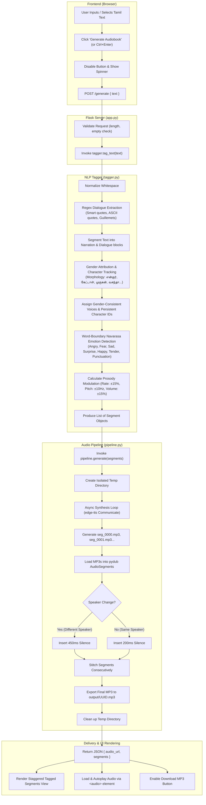
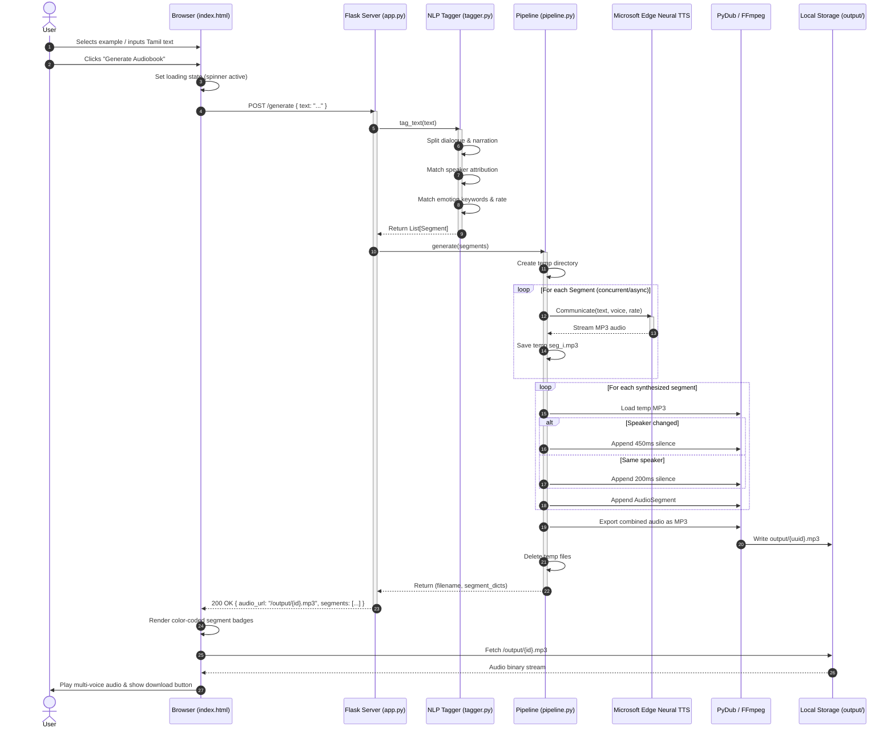
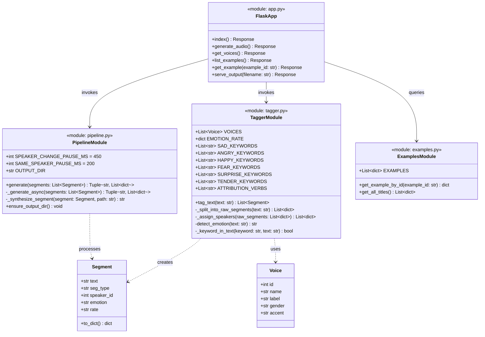
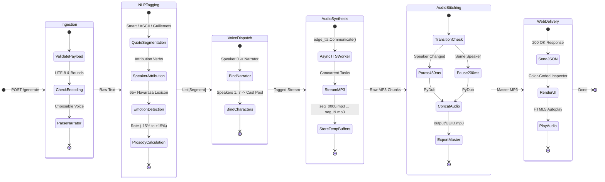

# Kural AI — UML & Architecture Diagrams

High-resolution PNG diagrams rendered directly from the source Mermaid code are available in the [`diagrams/`](file:///c:/Sricharan/GitHub/Kural%20AI/diagrams) directory:

- [**`workflow_diagram_16x9.png`**](file:///c:/Sricharan/GitHub/Kural%20AI/diagrams/workflow_diagram_16x9.png) — *Horizontal workflow diagram proportioned for 16:9 PPT slides*
- [**`uml_state_diagram.png`**](file:///c:/Sricharan/GitHub/Kural%20AI/diagrams/uml_state_diagram.png) — *UML State Machine Diagram (lifecycle & transition states)*
- [**`uml_sequence_diagram.png`**](file:///c:/Sricharan/GitHub/Kural%20AI/diagrams/uml_sequence_diagram.png) — *UML Sequence Diagram (interaction flow)*
- [**`uml_component_diagram.png`**](file:///c:/Sricharan/GitHub/Kural%20AI/diagrams/uml_component_diagram.png) — *UML Component & Subsystem Architecture Diagram*
- [**`uml_class_diagram.png`**](file:///c:/Sricharan/GitHub/Kural%20AI/diagrams/uml_class_diagram.png) — *UML Class & Module Structure Diagram*

---

## 1. End-to-End Workflow Diagram

Detailed state & data processing pipeline from raw Tamil text input to synthesized audiobook playback.



---

## 2. UML Sequence Diagram

Runtime interactions between the Client, Flask API, NLP Tagger, Audio Pipeline, and External Edge TTS Cloud Service.



---

## 3. UML Component Diagram

High-level architectural components, boundaries, and dependencies.

```mermaid
componentDiagram
    package "Client Tier" {
        [Vanilla Web UI] as UI
        [Audio Player Component] as Player
        [Segment Visualizer] as Visualizer
        [Example Selector] as Selector
    }

    package "Application Tier (Flask)" {
        [HTTP Routing & REST API] as API
        [Static File Server] as StaticServer
    }

    package "Core Engine" {
        [Regex NLP Tagger] as Tagger
        [Audio Stitching Pipeline] as Pipeline
        [Curated Examples Repository] as Examples
    }

    package "External Services & System Libraries" {
        cloud "Microsoft Edge Neural TTS" as CloudTTS
        [PyDub Audio Processing] as Pydub
        [FFmpeg Engine] as FFmpeg
    }

    database "File System" {
        folder "/output (MP3s)" as OutputStorage
        folder "/static (HTML/CSS/JS)" as StaticStorage
    }

    UI --> API : POST /generate
    UI --> API : GET /voices, /examples
    StaticServer --> StaticStorage : Serves index.html
    API --> Tagger : Passes raw text
    API --> Pipeline : Passes tagged segments
    API --> Examples : Queries sample passages
    API --> OutputStorage : Serves generated MP3s
    
    Pipeline ..> CloudTTS : edge_tts.Communicate()
    Pipeline ..> Pydub : Audio concatenation & pauses
    Pydub ..> FFmpeg : Transcoding & stitching
    Pipeline --> OutputStorage : Writes .mp3 files
```

---

## 4. UML Class Diagram

Data structures, types, module boundaries, and relationships.



---

## 5. UML State Machine Diagram

State transitions and lifecycle events across the ingestion, NLP parsing, voice dispatch, neural synthesis, pause injection, and audio delivery stages.



